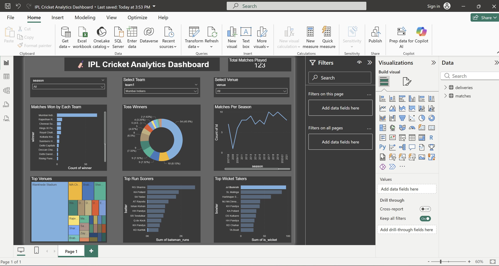

# 🏏 IPL Cricket Analytics Dashboard

An interactive cricket analytics dashboard built using **Microsoft Power BI**
analyzing IPL match data from 2008 to 2023.

## 📊 Dashboard Preview

## 🔍 Key Insights
- Teams with most IPL wins (Mumbai Indians leads)
- Toss winner vs match winner analysis
- Matches played per season trend
- Top 10 run scorers (RG Sharma leads)
- Top 10 wicket takers (JJ Bumrah leads)
- Most used venues across IPL seasons

## 🛠️ Tools Used
- **Microsoft Power BI Desktop** — Dashboard creation
- **Kaggle IPL Dataset** — Data source
- **Power Query** — Data cleaning
- **DAX** — Data modeling

## 📁 Dataset
- Source: Kaggle IPL Complete Dataset 2008–2023
- Files: matches.csv, deliveries.csv

## ✨ Features
- Interactive slicers (Season, Team, Venue)
- Cross-filtering across all visuals
- KPI card showing total matches played
- Professional dark theme
